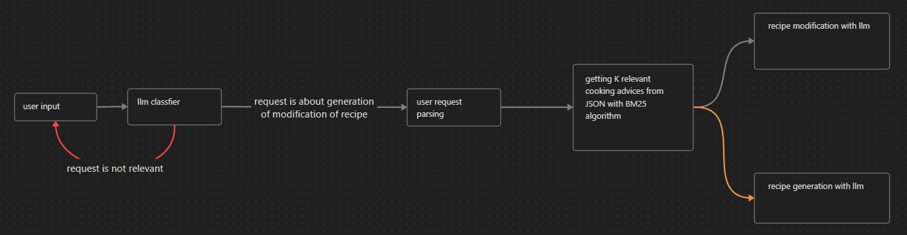

# Recipe-RAG

A ~~sample~~ simple RAG app that uses the Groq API to modify and generate recipes based on a user's personal preferences and input, with the help of LLMs.

### Deployment

1. Configure the project using the `.env`.
2. Start the app with `docker compose up`.
